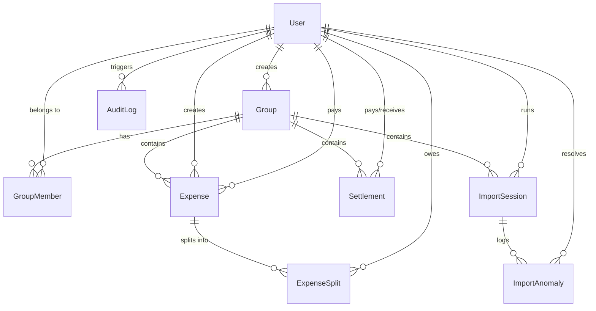

# SplitSmart — Project Scope & Anomaly Log Documentation

This document outlines the CSV data validation parameters, details of the **12 Anomaly Detection Rules** implemented in our parser wizard, and the **Normalized PostgreSQL Relational Database Schema** designed to track shared expense records, memberships, currency histories, import logs, and audits.

---

## 🔍 Part 1: CSV Import Anomaly Log

When users import bulk expense sheets via the CSV Import Wizard, the SplitSmart backend runs a pipeline of **12 anomaly detectors** before committing any transactions. This prevents data pollution, double-counting, currency issues, and date conflicts.

Anomalies are divided into three severity tiers:
*   🔴 **ERROR**: Prevents row importing unless fixed (requires manual edit or row exclusion).
*   🟡 **WARNING**: Highlights potential concerns that can be overridden or accepted.
*   🔵 **INFO**: Purely informational anomalies that are resolved automatically.

### The 12 Anomaly Detection Rules

| # | Anomaly Type | Severity | Description | How It Is Handled / Resolved |
| :--- | :--- | :--- | :--- | :--- |
| **1** | `NEGATIVE_AMOUNT` | 🔴 **ERROR** | Amount in row is less than zero (e.g., `-250`). | The system blocks import. Users can click **Approve Suggestion** to auto-convert to absolute value (positive), or skip/delete the row if it was a refund. |
| **2** | `MISSING_PAYER` | 🔴 **ERROR** | The field identifying who paid the bill is blank or missing. | The system blocks import. The user must manually edit the row in the review screen and select a valid group member to map the payment. |
| **3** | `AMOUNT_MISMATCH` | 🔴 **ERROR** | Multiple rows share the same `transaction_id` but specify different amounts. | The system blocks import due to conflicting transaction logs. The user must verify the source bank statement and fix the amount discrepancy. |
| **4** | `INVALID_MEMBER_NAME` | 🔴 **ERROR** / 🟡 **WARNING** | Payer or split participant name is not registered in the group. | **Fuzzy Matching**: If the name is close to a member (Levenshtein distance ≤ 2), the system marks it as a **WARNING** and suggests the correct name (e.g., "Alce" ➡️ "Alice"). If no close match exists, it is marked as an **ERROR**, requiring the user to add the member to the group first or edit the name. |
| **5** | `DUPLICATE_EXPENSE` | 🟡 **WARNING** | Same description, amount, date, and payer are found in another row. | Flags potential double-entry exports (overlapping bank statements). Users can choose to **Skip Duplicate** or **Keep Row** if they were genuinely two identical transactions. |
| **6** | `SETTLEMENT_AS_EXPENSE` | 🟡 **WARNING** | Description contains payment keywords (e.g., "settlement", "repaid", "paid back"). | Prevents double-counting settlements as expenses. The system alerts the user and suggests recording it as a Settlement instead of an Expense. |
| **7** | `INVALID_SPLIT` | 🟡 **WARNING** | Percentages do not sum to 100%, or exact split amounts do not equal the total. | The wizard displays a balance warning. Users can choose to re-distribute the shares equally, or edit split ratios directly on the screen. |
| **8** | `DUPLICATE_TRANSACTION_ID` | 🟡 **WARNING** | An external `transaction_id` appears multiple times in the CSV. | Alert for duplicated export lines. User can approve the duplicate transaction or delete the redundant row. |
| **9** | `FUTURE_DATE` | 🟡 **WARNING** | Expense date is set ahead of the current calendar date. | Warns against future typos. The wizard suggests updating the date to the current date or letting the user approve the pre-dated billing event. |
| **10** | `EXPENSE_AFTER_MEMBER_LEFT` | 🟡 **WARNING** | Date of expense is after a split member's `leftAt` group timestamp. | Restricts bill allocation to members who were not active in the flat/group during that period. Suggests removing the departed member from the split. |
| **11** | `EXPENSE_BEFORE_MEMBER_JOINED` | 🟡 **WARNING** | Date of expense is before a split member's `joinedAt` group timestamp. | Ensures late joiners aren't billed for historical costs that occurred before they entered the group. Suggests removing them from the split. |
| **12** | `CURRENCY_MISMATCH` | 🔵 **INFO** | The expense currency (e.g., `USD`) differs from the group currency (`INR`). | **Auto-Resolved**: Marked for informational transparency. The system automatically fetches/applies the effective date exchange rate (e.g., `83.5` INR/USD) to compute the converted amount. |

---

## 🗄️ Part 2: Database Schema (Prisma / PostgreSQL)

Our relational database schema is built using PostgreSQL to maintain high integrity and track state histories (e.g. member joins/leaves, currency history, audit trails).

### Schema Architecture Diagram

### Table Definitions & Relations

#### 1. `users` (User Account Profiles)
Stores user credentials, emails, and profile image assets.
*   `id` (String, Primary Key, CUID)
*   `name` (String)
*   `email` (String, Unique index)
*   `passwordHash` (String)
*   `image` (String, Nullable)
*   `createdAt`, `updatedAt` (DateTime)

#### 2. `groups` (Expense Ledgers)
Represents a distinct ledger of expenses shared between members (e.g. "Flatmates", "Trip").
*   `id` (String, Primary Key, CUID)
*   `name` (String)
*   `description` (String, Nullable)
*   `currency` (Enum: `INR`, `USD`) - The base currency used to simplify debts.
*   `createdById` (String, Foreign Key -> `users`)
*   `createdAt`, `updatedAt` (DateTime)

#### 3. `group_members` (Membership Durations)
**Critical Design Decision**: Instead of a simple binary mapping, this table records when members join and leave. This enables accurate temporal validations for expenses (e.g. validating if a roommate was living in the house when an electricity bill was charged).
*   `id` (String, Primary Key, CUID)
*   `userId` (String, Foreign Key -> `users`, On Delete Cascade)
*   `groupId` (String, Foreign Key -> `groups`, On Delete Cascade)
*   `role` (Enum: `ADMIN`, `MEMBER`)
*   `joinedAt` (DateTime)
*   `leftAt` (DateTime, Nullable) - Null indicates they are currently active.
*   `isActive` (Boolean)
*   *Indexes*: Unique combination on `[userId, groupId, joinedAt]` (supports users re-joining groups over time) and compound index `[groupId, isActive]`.

#### 4. `expenses` (Expense Records)
Logs the payment header. Supports multi-currency conversion.
*   `id` (String, Primary Key, CUID)
*   `groupId` (String, Foreign Key -> `groups`, On Delete Cascade)
*   `paidById` (String, Foreign Key -> `users`) - Who paid the bill.
*   `createdById` (String, Foreign Key -> `users`) - Who registered it.
*   `amount` (Float) - Original amount.
*   `currency` (Enum: `INR`, `USD`) - Original currency of the bill.
*   `exchangeRate` (Float) - The rate applied to convert to the base currency.
*   `convertedAmount` (Float) - Computed cost in the group's default currency (for balance engines).
*   `category` (String)
*   `description` (String)
*   `notes` (String, Nullable)
*   `date` (DateTime) - Date the expense occurred.
*   `splitType` (Enum: `EQUAL`, `EXACT`, `PERCENTAGE`, `SHARES`)
*   `transactionId` (String, Nullable) - External reference ID from imports.
*   `isDeleted` (Boolean) - Soft delete flag to maintain historical audit references.

#### 5. `expense_splits` (Individual Shares Owed)
Detailed breakdowns of the shares owed by each participant for an expense.
*   `id` (String, Primary Key, CUID)
*   `expenseId` (String, Foreign Key -> `expenses`, On Delete Cascade)
*   `userId` (String, Foreign Key -> `users`) - Who owes the money.
*   `amount` (Float) - Owed amount in original expense currency.
*   `percentage` (Float, Nullable) - For PERCENTAGE split types.
*   `shares` (Int, Nullable) - For SHARES split types.
*   `owedAmount` (Float) - Computed debt in the group's base currency (summed by balance calculations).

#### 6. `settlements` (Paybacks Ledger)
Records cash repayments between debtors and creditors.
*   `id` (String, Primary Key, CUID)
*   `groupId` (String, Foreign Key -> `groups`, On Delete Cascade)
*   `payerId` (String, Foreign Key -> `users`) - Debtor making the payback.
*   `receiverId` (String, Foreign Key -> `users`) - Creditor receiving the payback.
*   `amount` (Float)
*   `currency` (Enum: `INR`, `USD`)
*   `notes` (String, Nullable)
*   `settledAt`, `createdAt` (DateTime)

#### 7. `import_sessions` (CSV Session Tracker)
Tracks each CSV file uploaded, parsed, and imported.
*   `id` (String, Primary Key, CUID)
*   `groupId` (String, Foreign Key -> `groups`, On Delete Cascade)
*   `userId` (String, Foreign Key -> `users`)
*   `filename` (String)
*   `totalRows` (Int)
*   `importedRows` (Int)
*   `skippedRows` (Int)
*   `status` (Enum: `PENDING`, `PROCESSING`, `REVIEW`, `IMPORTING`, `COMPLETED`, `FAILED`)
*   `summary` (Json) - Summary of warning/error counts.

#### 8. `import_anomalies` (Detected Anomaly Records)
Logs individual anomalies detected in an import session, their details, and how they were resolved.
*   `id` (String, Primary Key, CUID)
*   `sessionId` (String, Foreign Key -> `import_sessions`, On Delete Cascade)
*   `rowNumber` (Int)
*   `type` (Enum AnomalyType)
*   `severity` (Enum AnomalySeverity)
*   `description` (String)
*   `suggestedAction` (String)
*   `rawData` (Json) - Preserves the entire original CSV row data for audit purposes.
*   `field` (String, Nullable) - Problematic column.
*   `currentValue`, `suggestedValue` (String, Nullable)
*   `resolution` (Enum: `PENDING`, `APPROVED`, `REJECTED`, `MODIFIED`, `AUTO_RESOLVED`)
*   `resolvedById` (String, Foreign Key -> `users`, Nullable)
*   `resolvedAt` (DateTime, Nullable)

#### 9. `exchange_rates` (Currency Exchange Mappings)
Stores conversions between currencies over time.
*   `id` (String, Primary Key, CUID)
*   `fromCurrency`, `toCurrency` (Enum Currency)
*   `rate` (Float)
*   `source` (String) - e.g., "manual", "api"
*   `effectiveDate` (DateTime)

#### 10. `audit_logs` (System Audit Trail)
An immutable log capturing every database modification (inserts, updates, soft deletes) with exact `oldValue` and `newValue` JSON strings. This powers the Balance Trace Audit panel, allowing users to trace any debt back to the exact series of changes that created it.
*   `id` (String, Primary Key, CUID)
*   `userId` (String, Foreign Key -> `users`)
*   `action` (String) - e.g., "CREATE", "UPDATE", "DELETE", "IMPORT"
*   `entityType` (String) - e.g., "Expense", "Settlement"
*   `entityId` (String)
*   `oldValue` (Json, Nullable) - Original state.
*   `newValue` (Json, Nullable) - New state.
*   `metadata` (Json, Nullable)
*   `ipAddress` (String, Nullable)
*   `createdAt` (DateTime)
